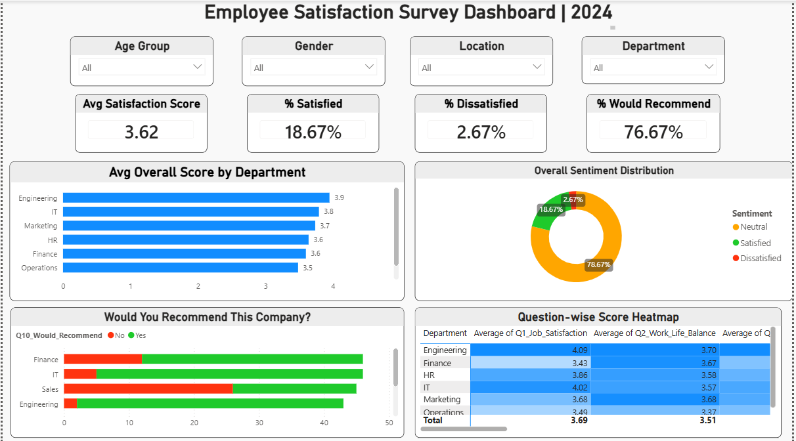
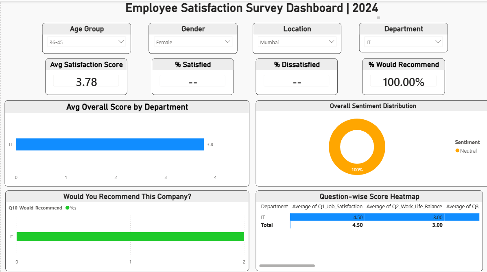

# 📊 Employee Satisfaction Survey Dashboard

## Overview
An interactive HR Analytics Dashboard built in Power BI analyzing 
employee satisfaction across 300 respondents, 7 departments, and 5 cities.

## Dashboard Preview

## Key Insights
- 📌 Overall Avg Satisfaction Score: 3.62 / 5
- ✅ 76.67% employees would recommend the company
- ⚠️ 78.67% employees are Neutral — engagement opportunity
- 🏆 Engineering is the most satisfied department (3.9)
- 📉 Operations has the lowest satisfaction score (3.5)

## Features
- Dynamic slicers by Department, Location, Gender, Age Group
- KPI Cards with live DAX measures
- Sentiment Analysis (Satisfied / Neutral / Dissatisfied)
- Question-wise Score Heatmap across all departments
- Recommend vs Not Recommend breakdown

## Tools Used
- Power BI Desktop
- Microsoft Excel
- DAX (Data Analysis Expressions)

## Files
| File | Description |
|------|-------------|
| Employee_Satisfaction_Dashboard.pbix | Main Power BI file |
| Employee_Survey_PowerBI.xlsx | Raw survey dataset (300 rows) |
| dashboard_preview.png | Dashboard screenshot |

## Dataset
- 300 employee responses
- 21 columns including demographics and 9 satisfaction questions
- Covers 7 departments and 5 cities across India
